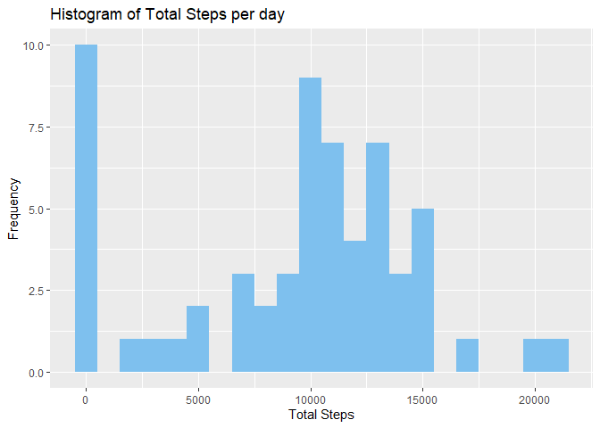
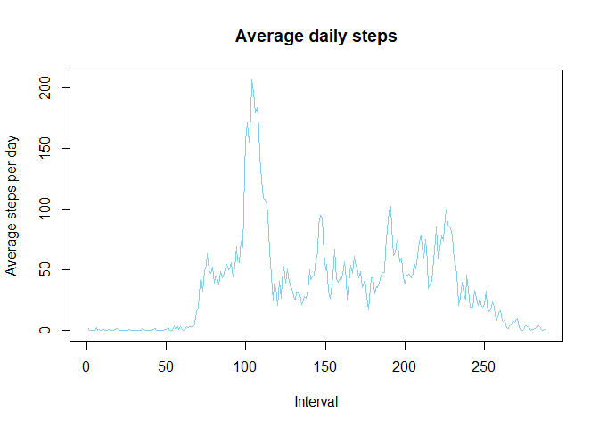
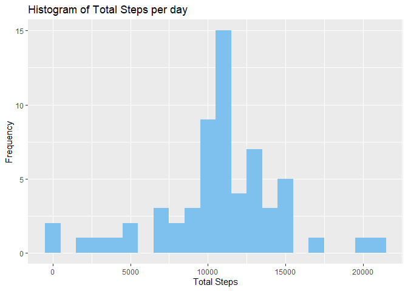
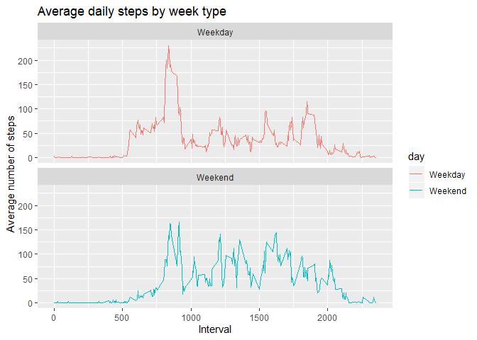

## Introduction

It is now possible to collect a large amount of data about personal movement using activity monitoring devices such as a Fitbit, Nike Fuelband, or Jawbone Up. These type of devices are part of the “quantified self” movement – a group of enthusiasts who take measurements about themselves regularly to improve their health, to find patterns in their behavior, or because they are tech geeks. But these data remain under-utilized both because the raw data are hard to obtain and there is a lack of statistical methods and software for processing and interpreting the data.

This assignment makes use of data from a personal activity monitoring device. This device collects data at 5 minute intervals through out the day. The data consists of two months of data from an anonymous individual collected during the months of October and November, 2012 and include the number of steps taken in 5 minute intervals each day.

The data for this assignment can be downloaded from the course web site:

Dataset: [Activity Monitoring Data](https://d396qusza40orc.cloudfront.net/repdata%2Fdata%2Factivity.zip) [52K]

The variables included in this dataset are:

1. steps: Number of steps taking in a 5-minute interval (missing values are coded as \color{red}{\verb|NA|}NA)
2. date: The date on which the measurement was taken in YYYY-MM-DD format
3. interval: Identifier for the 5-minute interval in which measurement was taken

The dataset is stored in a comma-separated-value (CSV) file and there are a total of 17,568 observations in this dataset.

## Loading and preprocessing the data

Firstly, we will download the required file and unzip it to find a csv file.


```r
library(data.table)
library(dplyr)
```

```
## 
## Attaching package: 'dplyr'
```

```
## The following objects are masked from 'package:data.table':
## 
##     between, first, last
```

```
## The following objects are masked from 'package:stats':
## 
##     filter, lag
```

```
## The following objects are masked from 'package:base':
## 
##     intersect, setdiff, setequal, union
```

```r
library(ggplot2)
library(lubridate)
```

```
## 
## Attaching package: 'lubridate'
```

```
## The following objects are masked from 'package:data.table':
## 
##     hour, isoweek, mday, minute, month, quarter, second, wday,
##     week, yday, year
```

```
## The following object is masked from 'package:base':
## 
##     date
```

```r
path <- getwd()

download.file("https://d396qusza40orc.cloudfront.net/repdata%2Fdata%2Factivity.zip",
              destfile = paste(path,"Activity_monitoring_data.zip",sep = "/"))

unzip("Activity_monitoring_data.zip")

activity_data <- read.csv("activity.csv",stringsAsFactors = FALSE)

str(activity_data)
```

```
## 'data.frame':	17568 obs. of  3 variables:
##  $ steps   : int  NA NA NA NA NA NA NA NA NA NA ...
##  $ date    : chr  "2012-10-01" "2012-10-01" "2012-10-01" "2012-10-01" ...
##  $ interval: int  0 5 10 15 20 25 30 35 40 45 ...
```

```r
summary(activity_data)
```

```
##      steps            date              interval     
##  Min.   :  0.00   Length:17568       Min.   :   0.0  
##  1st Qu.:  0.00   Class :character   1st Qu.: 588.8  
##  Median :  0.00   Mode  :character   Median :1177.5  
##  Mean   : 37.38                      Mean   :1177.5  
##  3rd Qu.: 12.00                      3rd Qu.:1766.2  
##  Max.   :806.00                      Max.   :2355.0  
##  NA's   :2304
```

## What is mean total number of steps taken per day?

1. The total number of steps taken per day

    Firstly, we will change the date column to a date vector


```r
activity_data$date <- ymd(activity_data$date)

total_steps_per_day <- activity_data%>%
    group_by(date)%>%
    summarize(Total_steps = sum(steps,na.rm = TRUE),
              N = n())

head(total_steps_per_day,10)
```

```
## # A tibble: 10 x 3
##    date       Total_steps     N
##    <date>           <int> <int>
##  1 2012-10-01           0   288
##  2 2012-10-02         126   288
##  3 2012-10-03       11352   288
##  4 2012-10-04       12116   288
##  5 2012-10-05       13294   288
##  6 2012-10-06       15420   288
##  7 2012-10-07       11015   288
##  8 2012-10-08           0   288
##  9 2012-10-09       12811   288
## 10 2012-10-10        9900   288
```

2.Histogram of the total number of steps taken each day


```r
ggplot(total_steps_per_day,aes(Total_steps)) +
    geom_histogram(fill = "skyblue2",binwidth = 1000) +
    labs(title = "Histogram of Total Steps per day",
         x = "Total Steps",
         y = "Frequency")
```

<!-- -->

3. The mean and median of the total number of steps taken each day


```r
# Mean
mean(total_steps_per_day$Total_steps,na.rm = TRUE)
```

```
## [1] 9354.23
```

```r
# Median
median(total_steps_per_day$Total_steps,na.rm = TRUE)
```

```
## [1] 10395
```

## What is the average daily activity pattern?

1. Time series plot of the 5 minute interval and the average number of steps taken,averaged across all days


```r
interval_mean_steps <- activity_data%>%
    group_by(interval)%>%
    summarize(mean_steps = mean(steps,na.rm = TRUE))

plot(interval_mean_steps$mean_steps,
     type = "l",
     col = "skyblue",
     xlab = "Interval",
     ylab = "Average steps per day",
     main = "Average daily steps")
```

<!-- -->

## Imputing missing values

1. The total number of missing values in the dataset


```r
nrow(activity_data[is.na(activity_data$steps),])
```

```
## [1] 2304
```

2. Startegy for filling in the missing values in the dataset : Mean of the steps as per the intervals


```r
new_activity_data <- activity_data%>%
    group_by(interval)%>%
    mutate(steps = ifelse(is.na(steps),mean(steps,na.rm = TRUE),steps))
```

3. New dataset with the missing values filled in 


```r
write.csv(new_activity_data,"Tidy_data.csv")
```

4. Histogram of the total number of steps taken each day with the new data


```r
# Total Number of steps taken each day :

tidy_data_total_steps <- new_activity_data%>%
    group_by(date)%>%
    summarize(Total_steps = sum(steps,na.rm = TRUE),
              N = n())

# Histogram :

ggplot(tidy_data_total_steps,aes(Total_steps)) +
    geom_histogram(fill = "skyblue2",binwidth = 1000) +
    labs(title = "Histogram of Total Steps per day",
         x = "Total Steps",
         y = "Frequency")
```

<!-- -->

```r
# Mean :
mean(tidy_data_total_steps$Total_steps,na.rm = TRUE)
```

```
## [1] 10766.19
```

```r
# Median :
median(tidy_data_total_steps$Total_steps,na.rm = TRUE)
```

```
## [1] 10766.19
```
    
    Comparison with the first part :

Type of Estimate | Mean_steps | Median_steps
--- | --- | ---
First_part (with NA) | 9354.23 | 10395
Second_part (NAs filled) | 10766.19 | 10766.19 

## Are there differences in activity patterns between weekdays and weekends?

1. New factor variable in the tidy dataset (new_activity_data)


```r
new_activity_data$day <- ifelse(weekdays(new_activity_data$date) %in% c("Saturday","Sunday"),"Weekend","Weekday")

table(new_activity_data$day)
```

```
## 
## Weekday Weekend 
##   12960    4608
```

2. Make a panel plot containing a time series plot (type="l") of the 5-minute interval (x-axis) and the average number of steps taken, averaged across all weekday days or weekend days (y-axis).


```r
avg_steps_interval <- new_activity_data%>%
    group_by(interval,day)%>%
    summarize(mean = mean(steps,na.rm = TRUE),
              N = n())

ggplot(avg_steps_interval,aes(interval,mean,color = day)) +
    geom_line() + 
    facet_wrap(.~day,nrow = 2,ncol = 1) +
    labs(x = "Interval",
         y = "Average number of steps",
         title = "Average daily steps by week type")
```

<!-- -->
